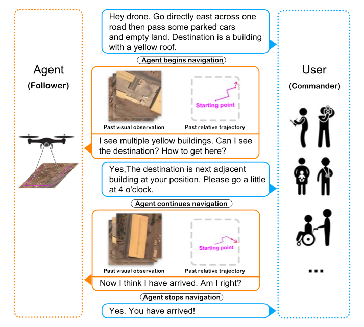
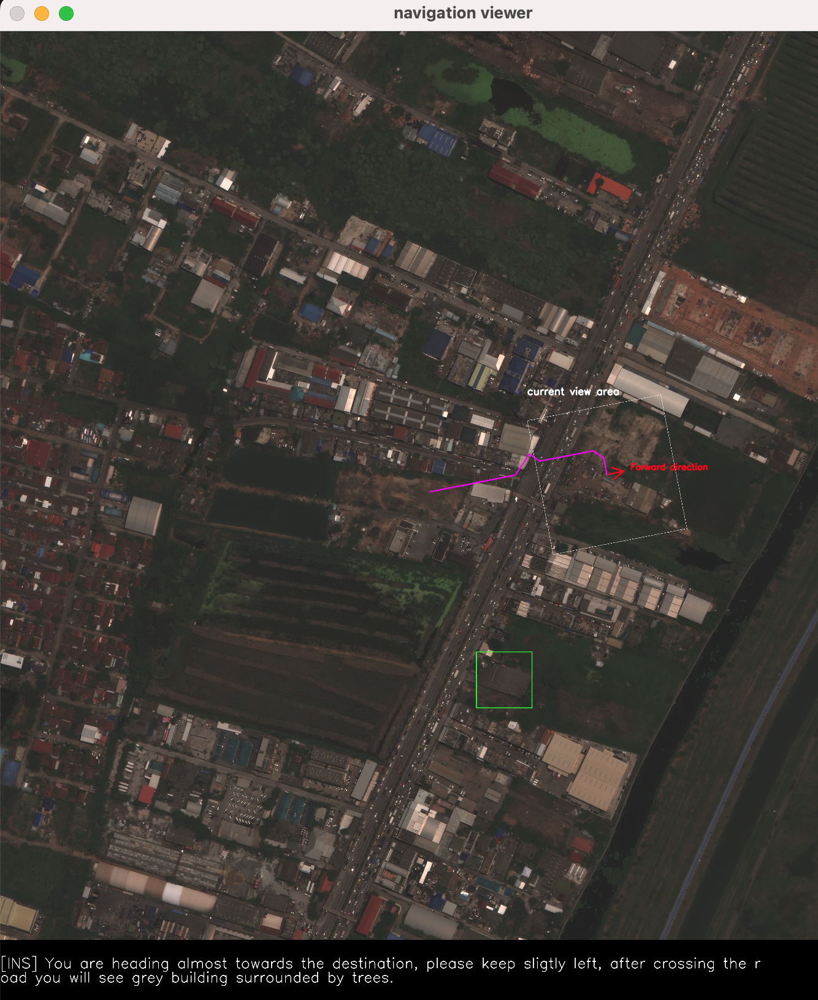

# Aerial Vision-and-Dialog Navigation

The ability to converse with humans and follow natural language commands is crucial for intelligent unmanned aerial vehicles (a.k.a. drones). It can relieve people's burden of holding a controller all the time, allow multitasking, and make drone control more accessible for people with disabilities or with their hands occupied. To this end, we introduce Aerial Vision-and-Dialog Navigation (AVDN), to navigate a drone via natural language conversation. We build a drone simulator with a continuous photorealistic environment and collect a new AVDN dataset of over 3k recorded navigation trajectories with asynchronous human-human dialogs between commanders and followers. The commander provides initial navigation instruction and further guidance by request, while the follower navigates the drone in the simulator and asks questions when needed. During data collection, followers' attention on the drone's visual observation is also recorded. Based on the AVDN dataset, we study the tasks of aerial navigation from (full) dialog history and propose an effective Human Attention Aided Transformer model (HAA-Transformer), which learns to predict both navigation waypoints and human attention. 




Todos:
- [x] Data released
- [x] Train code uploaded
- [x] Inference code uploaded and checkpoint released
- [ ] Eval.ai challenge setup

git pull https://github.com/UeFan/AVDN.git

# Download Data

**Download xView data** 

Our AVDN dataset uses satellite images from the xView dataset. Follow the instruction at https://challenge.xviewdataset.org/data-download to download xView dataset. 

Then move the images in xView dataset to under AVDN directory. (Assume the xView images are at ./XVIEW_images):
```
mkdir -p Aerial-Vision-and-Dialog-Navigation/datasets/XVIEW/train_images

cp -r XVIEW_images/*.tif Aerial-Vision-and-Dialog-Navigation/datasets/XVIEW/train_images/
```


**Download AVDN datasets**

 (https://sites.google.com/view/aerial-vision-and-dialog/home):

```
mkdir -p Aerial-Vision-and-Dialog-Navigation/datasets/XVIEW/annotations

gdown 1bdX5E1uEQXg8T8b5T7sh6WXb4V5rcG_Q -O Aerial-Vision-and-Dialog-Navigation/datasets/XVIEW/annotations/train_data.json

gdown 1y0PAW3bN1KtWPx9SkKuJU7o0c0tJsnzY -O Aerial-Vision-and-Dialog-Navigation/datasets/XVIEW/annotations/val_seen_data.json

gdown 1MYVAPeeS7Ydw4P7j1glvmYoE5yrN8Eo8 -O Aerial-Vision-and-Dialog-Navigation/datasets/XVIEW/annotations/val_unseen_data.json

gdown 14BijI07ukKCSDh3T_RmUG83z6Oa75M-U -O Aerial-Vision-and-Dialog-Navigation/datasets/XVIEW/annotations/test_unseen_data.json
```
# Explore AVDN dataset

We provide a script for visualizing the trajectories and corresponding dialgues. To run the script, plase download the xView data and AVDN dataset and provide to the script with the paths to the folder containing xView images and to AVDN dataset (either train, val_seen or val_unseen).

```
python Aerial-Vision-and-Dialog-Navigation/src/visualize_sub_traj_new.py \
--xview_image_path {PATH_TO_XVIEW_IMG_FOLDER} \
--avdn_annotation_path {PATH_TO_AVDN_DATASET}/val_seen_data.json
```

# Training and Evaluation
**Download pre-trained xview-yolov3 weights**

```
gdown 1Ke-pA5jpq1-fsEwAch_iRCtJHx6rQc-Z -O Aerial-Vision-and-Dialog-Navigation/datasets/XVIEW/pretrain_weights/best.pt

```

**Download the training checkpoints corresponding to the experiments in the AVDN paper**


```
mkdir -p Aerial-Vision-and-Dialog-Navigation/datasets/XVIEW/et_haa/ckpts/

mkdir -p Aerial-Vision-and-Dialog-Navigation/datasets/XVIEW/lstm_haa/ckpts/

gdown 1fA6ckLVA-gsiOmWmOMkqJggTLbiJpFBI -O Aerial-Vision-and-Dialog-Navigation/datasets/XVIEW/et_haa/ckpts/best_val_unseen

gdown 1RYjo_vc5m5ZRUcjIFojZjke8RhlfX90I -O Aerial-Vision-and-Dialog-Navigation/datasets/XVIEW/lstm_haa/ckpts/best_val_unseen
```


**Install requirements**

```
pip install torch==1.11.0+cu113 -f https://download.pytorch.org/whl/torch_stable.html

pip install torchvision==0.12.0+cu113 -f -f https://download.pytorch.org/whl/torch_stable.html

pip install -r requirements.txt
```


**Run training or evaluation:**

The script, `scripts/avdn_paper/run_et_haa.sh`, includes commands for train and evaluate Human Attention Aided Transformer (HAA-Transformer) model.

The script, `scripts/avdn_paper/run_lstm_haa.sh`, includes commands for train and evaluate Human Attention Aided LSTM (HAA-LSTM) model.


```
cd Aerial-Vision-and-Dialog-Navigation/src

# For Human Attention Aided Transformer model
bash scripts/avdn_paper/run_et_haa.sh 

# For Human Attention Aided LSTM model
bash scripts/avdn_paper/run_lstm_haa.sh 
```
